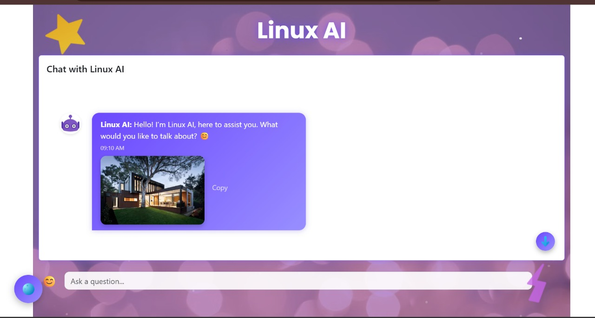

# 🤖 AI Chatbot using Gemini API with Python Backend and React Frontend

This project is a full-stack chatbot application powered by *Google's Gemini API, featuring a **Python backend* and a *React frontend. The chatbot processes user input and delivers intelligent responses using Gemini's conversational AI capabilities. Designed to run seamlessly in **IntelliJ IDEA*, it provides a smooth development experience for both frontend and backend workflows.

---

## 🚀 Features

- ⚡ Real-time AI chatbot powered by Gemini API
- 🔐 Secure API key handling using .env file
- 🧠 Python backend for fast API processing
- ⚛ React-based modern frontend UI
- 🌍 Easily extendable for advanced AI features (summarization, classification, etc.)
- 🛠 IntelliJ-friendly project structure with run configurations

---

## 🔧 Prerequisites

- Python 3.8 or higher
- Node.js (v16+ recommended)
- Google Gemini API key
- IntelliJ IDEA (for full-stack development and execution)

---

## Sample Output



## 🔐 Environment Variables

Create a .env file inside the backend/ directory with the following:

```env
GEMINI_API_KEY=your_gemini_api_key_here
# Navigate to backend folder
cd backend

# (Optional) Create virtual environment
python -m venv venv
source venv/bin/activate  # On Windows: venv\Scripts\activate

# Install dependencies
pip install -r requirements.txt

# Run the backend server
python main.py
# Open a new terminal and navigate to frontend folder
cd frontend

# Install frontend packages
npm install

# Start the React development server
npm start
